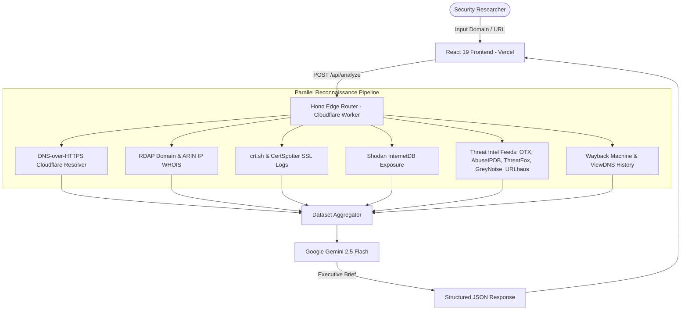

# ⚡ WEBTRACE — Domain Intelligence & Attack Surface Analyzer

<div align="center">


<br />

**Real-time OSINT reconnaissance, DNS/network topology inspection, threat aggregation, and AI-powered attack surface analysis.**

[🌐 Live Frontend (Vercel)](https://frontend-theta-seven-61.vercel.app) • [⚡ Edge API (Cloudflare Workers)](https://webtrace.phish-x.workers.dev) • [📖 Documentation](#-api-reference)

</div>

---

## 🧭 Overview

**WEBTRACE** (also known as **TRACE**) is a modular security reconnaissance and attack surface intelligence platform. It aggregates deep infrastructure metrics, DNS records, SSL certificate chains, multi-engine threat feeds, and Certificate Transparency logs into a unified, actionable cybersecurity dashboard.

### 🌐 Live Deployments

| Component | Platform | Status | URL |
| :--- | :--- | :--- | :--- |
| **Frontend UI** | **Vercel** |  | [frontend-theta-seven-61.vercel.app](https://frontend-theta-seven-61.vercel.app) |
| **Edge Backend** | **Cloudflare Workers** |  | [webtrace.phish-x.workers.dev](https://webtrace.phish-x.workers.dev) |

---

## 🚀 Key Modules & Capabilities



### 🔍 Intelligence Capabilities

- **🌐 DNS & Topology:** Queries `A`, `AAAA`, `MX`, `TXT`, `NS`, `SOA`, and `CAA` records via Cloudflare DoH. Inspects reverse DNS (`PTR`), identifies CNAME chains, and detects CDN/proxy presence (Cloudflare, Akamai, AWS CloudFront, Fastly).
- **🛡️ Email Security Posture:** Validates SPF policies (`v=spf1`), DMARC records (`_dmarc.<domain>`), and scans common DKIM selector permutations.
- **📜 Domain & Network WHOIS:** Retrieves structured RDAP records (`rdap.org` and ARIN), computes domain age, tracks DNSSEC signing status, and maps CIDR blocks and Autonomous System Numbers (ASN).
- **🔒 SSL/TLS Certificate Analysis:** Tracks certificate validity, expiration dates, days remaining, free CA detection (Let's Encrypt / ZeroSSL), and Subject Alternative Names (SANs) coverage.
- **🎯 Attack Surface & CVE Discovery:** Queries Shodan InternetDB for exposed services, open ports, CPE software fingerprints, and known vulnerabilities (CVEs).
- **🔎 Subdomain Enumeration:** Extracts all historical and active subdomains from Certificate Transparency (CT) logs, automatically flagging sensitive endpoints (`admin`, `vpn`, `staging`, `dev`, `portal`).
- **🚨 Multi-Engine Threat Intelligence:** Aggregates real-time reputation signals across AlienVault OTX, AbuseIPDB, ThreatFox (abuse.ch), GreyNoise, and URLhaus to compute a unified threat verdict (`CLEAN`, `SUSPICIOUS`, `MALICIOUS`).
- **🕰️ Archival & IP History:** Explores historical snapshots in the Wayback Machine and tracks historical IP resolutions.
- **🤖 AI-Generated Threat Brief:** Synthesizes the full scan dataset into a concise, 3–4 sentence plain-English executive summary using **Gemini 2.5 Flash**.

---

## 🏗️ Tech Stack & Architecture

- **Frontend:** React 19, TypeScript, Vite, TailwindCSS, Lucide Icons, Framer Motion. Hosted globally on **Vercel**.
- **Backend:** TypeScript, **Hono v4** web framework, running natively on **Cloudflare Workers** (V8 isolates at the Edge).
- **Communication:** Secure CORS-enabled JSON REST API supporting preflight caching.

---

## 🛠️ Project Structure

```
webtrace/
├── backend-worker/               # Cloudflare Worker (Production Serverless Backend)
│   ├── src/
│   │   └── index.ts              # Complete Hono API server & recon pipeline
│   ├── package.json              # Worker dependencies & scripts
│   ├── tsconfig.json             # TypeScript configuration for Workers
│   └── wrangler.jsonc            # Cloudflare Wrangler configuration & environment vars
├── frontend/                     # React / Vite Single Page Application
│   ├── src/
│   │   ├── App.tsx               # Main dashboard UI & scan visualizer
│   │   ├── main.tsx              # Application entry point
│   │   └── index.css             # Tailwind and design system tokens
│   ├── index.html                # HTML template
│   ├── package.json              # Frontend dependencies
│   └── vite.config.ts            # Vite build configuration
├── backend/                      # Original Python / FastAPI implementation (Reference)
│   ├── main.py                   # Python API server
│   ├── modules/                  # Python recon modules
│   └── requirements.txt          # Python dependencies
└── docs/                         # Guides and architectural documentation
```

---

## ⚡ Quickstart & Local Development

### 1. Prerequisites
- **Node.js** (v18.0.0 or later)
- **npm** or **pnpm**
- (Optional) **Cloudflare Wrangler CLI** (`npm install -g wrangler`)

### 2. Run the Cloudflare Worker Backend
```bash
# Navigate to the worker folder
cd backend-worker

# Install dependencies
npm install

# Start local development server on http://localhost:8787
npm run dev
```

### 3. Run the Frontend
```bash
# Navigate to the frontend folder
cd ../frontend

# Install dependencies
npm install

# Set your API URL in .env.local (optional, defaults to local dev server)
echo "VITE_API_URL=http://localhost:8787" > .env.local

# Start the Vite development server
npm run dev
```

---

## 📡 API Reference

### 1. `GET /api/ping`
Performs a health check on the backend worker.

**Response:**
```json
{
  "status": "online",
  "tool": "TRACE",
  "version": "2.0"
}
```

### 2. `POST /api/analyze`
Performs a full OSINT and attack surface analysis on the target domain or URL.

**Request:**
```json
{
  "url": "example.com"
}
```

**Response Sample:**
```json
{
  "domain": "example.com",
  "address_lookup": {
    "available": true,
    "canonical": "example.com",
    "ipv4": ["93.184.215.14"],
    "ipv6": ["2606:2800:21f:cb07:6820:80da:af6b:8b2c"],
    "cdn_detected": null,
    "real_ip_hidden": false
  },
  "whois_domain": {
    "available": true,
    "registrar": "RESERVED-Internet Assigned Numbers Authority",
    "age_days": 10582,
    "dnssec": "SIGNED"
  },
  "threat_intel": {
    "available": true,
    "verdict": "CLEAN",
    "flagged_by": 0
  },
  "ai_explanation": {
    "available": true,
    "summary": "Target domain example.com exhibits a clean security posture with no active threat pulses or abuse reports. DNSSEC is enabled, and SSL certificate parameters are within normal thresholds.",
    "engine": "gemini-2.5-flash"
  }
}
```

---

## 🚀 Deployment

### Deploying the Cloudflare Worker
```bash
cd backend-worker
npx wrangler deploy
```

### Deploying the Vercel Frontend
```bash
cd frontend
# Set the environment variable in Vercel
npx vercel env add VITE_API_URL production --value "https://webtrace.phish-x.workers.dev" --yes

# Deploy to production
npx vercel --prod --yes
```

---

## ⚖️ License & Ethical Use

This software is released under the **Apache 2.0 License**. 

> **Disclaimer:** WEBTRACE is built exclusively for authorized cybersecurity research, vulnerability assessment, and educational purposes. Ensure you have explicit authorization before assessing target networks and domains.
