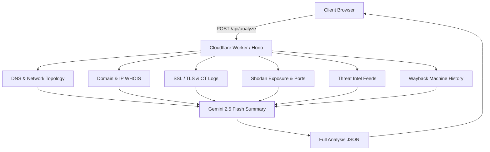

# ⚡ WEBTRACE

<div align="center">


<br />

**Real-time OSINT Domain Intelligence & Attack Surface Analyzer.**

[🌐 **Live Demo (Frontend)**](https://frontend-theta-seven-61.vercel.app) • [⚡ **Edge API (Worker)**](https://webtrace.phish-x.workers.dev)

</div>

---

## 🎯 What is WEBTRACE?

**WEBTRACE** is a high-speed domain reconnaissance tool that queries multiple intelligence sources in parallel (DNS, RDAP WHOIS, SSL logs, Shodan, threat feeds, and Wayback history) and generates an executive AI security brief using Google Gemini.

### 🌐 Live URLs

- **Frontend App (Vercel):** [https://frontend-theta-seven-61.vercel.app](https://frontend-theta-seven-61.vercel.app)
- **API Endpoint (Cloudflare Worker):** [https://webtrace.phish-x.workers.dev/api/analyze](https://webtrace.phish-x.workers.dev/api/analyze)

---

## 🔄 Architecture



---

## ✨ Features

- **🌐 DNS & Topology:** `A`, `AAAA`, `MX`, `TXT`, `NS`, `SOA`, `CAA` records via Cloudflare DoH, plus PTR reverse DNS and CDN detection.
- **🛡️ Email Security:** SPF (`v=spf1`), DMARC (`_dmarc`), and common DKIM selector checks.
- **📜 RDAP WHOIS:** Domain age, registrar details, nameservers, and ARIN network CIDR/ASN.
- **🔒 SSL Analysis:** Cert validity, expiry countdown, SANs coverage, and free CA detection.
- **🎯 Open Ports & CVEs:** Shodan InternetDB lookup for open ports, CPEs, and known vulnerabilities.
- **🔎 Subdomain Discovery:** Enumerates subdomains from CT logs and flags high-value targets (`admin`, `vpn`, `staging`).
- **🚨 Multi-Engine Threat Intel:** Aggregates OTX, AbuseIPDB, ThreatFox, GreyNoise, and URLhaus into a single verdict (`CLEAN`, `SUSPICIOUS`, `MALICIOUS`).
- **🤖 AI Security Brief:** 3–4 sentence plain-English summary powered by **Gemini 2.5 Flash**.

---

## 💻 Tech Stack

- **Frontend:** React 19, TypeScript, Vite, TailwindCSS, Lucide Icons, Framer Motion — *Hosted on Vercel*
- **Backend:** TypeScript, Hono v4, Cloudflare Workers (Edge Serverless) — *Hosted on Cloudflare*

---

## 🚀 Quickstart

### 1. Run Backend Worker Locally
```bash
cd backend-worker
npm install
npm run dev
# Running on http://localhost:8787
```

### 2. Run Frontend Locally
```bash
cd frontend
npm install
npm run dev
# Running on http://localhost:5173
```

---

## 📡 API Example

```bash
curl -X POST "https://webtrace.phish-x.workers.dev/api/analyze" \
  -H "Content-Type: application/json" \
  -d '{"url": "google.com"}'
```

---

## ⚖️ License

Distributed under the **Apache 2.0 License**. For authorized cybersecurity research and testing only.
